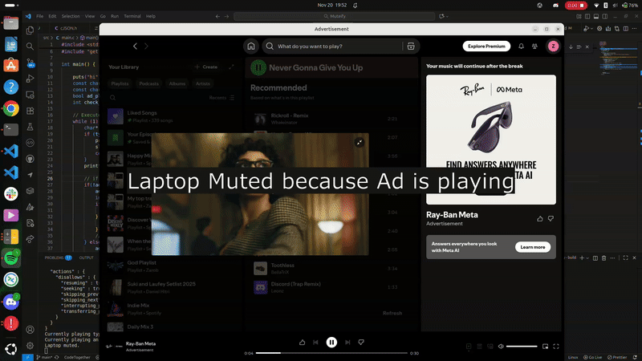

# Muteify - Automatic Spotify Ad Muter

## Demo Video


## Overview
Muteify automatically detects and mutes Spotify ads by monitoring the Spotify API and controlling your system audio. When an ad plays, your computer mutes. When music returns, it unmutes automatically.

## How It Works
1. Authenticates with Spotify API using OAuth 2.0
2. Continuously polls the Spotify API every 10 seconds to check playback type
3. Detects when content switches between "track" (music) and "ad" (advertisement)
4. Uses PulseAudio (`pactl`) to mute/unmute system audio accordingly

## Technologies Used
- **C** - Core application logic
- **libcurl** - HTTP requests to Spotify API
- **cJSON** - JSON parsing for API responses
- **CMake** - Build system
- **Spotify Web API** - Real-time playback information
- **PulseAudio** - System audio control

## Prerequisites
- Linux system with PulseAudio
- Spotify account
- Spotify Developer App credentials
- Libraries: `libcurl`, `cjson`

### Install Dependencies (Ubuntu/Debian)
```bash
sudo apt-get update
sudo apt-get install libcurl4-openssl-dev libcjson-dev cmake build-essential
```

## Setup

### 1. Create Spotify Developer App
1. Go to [Spotify Developer Dashboard](https://developer.spotify.com/dashboard)
2. Create a new app
3. Note your **Client ID** and **Client Secret**
4. Add redirect URI: `http://127.0.0.1:8888/callback`

### 2. Get Access Token
1. Run the token getter script:
   ```bash
   python3 get_token.py
   ```

2. Your browser will automatically open. Log in to Spotify when prompted.

3. After logging in, the access token will be automatically saved to `token.txt`

4. You'll see a success message in the terminal

5. Press `Ctrl+C` to stop the Flask server

### 3. Build the Project
```bash
mkdir build
cd build
cmake ..
make
```

### 4. Run Muteify
```bash
./Muteify
```

Press `Ctrl+C` to stop the program.

## Technical Details

### API Integration
- Uses Spotify's `/v1/me/player` endpoint
- Authenticates with Bearer token in Authorization header
- Parses JSON response to extract `currently_playing_type` field

### Audio Control
- Mute command: `pactl set-sink-mute @DEFAULT_SINK@ 1`
- Unmute command: `pactl set-sink-mute @DEFAULT_SINK@ 0`

## Limitations
- Requires active Spotify playback to function
- Linux-only (uses PulseAudio)
- 10-second polling interval means ads may play briefly before muting
